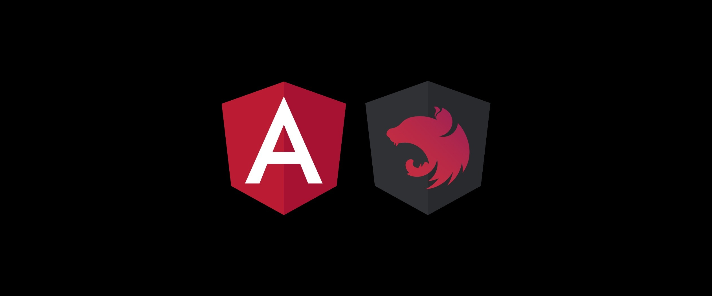

# Blog personal 2.0

## Descripción:

Este proyecto es un blog que tiene el objetivo de ser una presentación personal y emplearse también para subir artículos acerca de temas relacionados con el mundo del desarrollo web.
Estaría compuesto de cuatro partes:
  - Base de datos MongoDB: Contiene la información necesaria para el funcionamiento del proyecto.
  - API REST: Realizada con el frameword NestJS, es la encargada de interactuar con la base de datos para inyectar información o devolvérsela al cliente.
  - Aplicación de gestión de artículos: Se trata de un cliente desarrollado con Angular cuya función es la de proporcionar una plataforma mediante la cual se puedan subir los artículos para su publicación en el blog.
  - Blog: Cliente creado con Angular que muestro los artículos almacenados en la base de datos mediante peticiones a la api REST.
